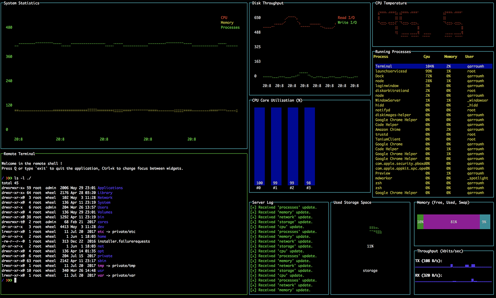

<p align="center">
  
</p>

# sys-get
> Portable system information provider command-line tool.

[](https://www.codefactor.io/repository/github/hqarroum/sys-get/overview/master)

Current version: **1.0.3**

Lead Maintainer: [Halim Qarroum](mailto:hqm.post@gmail.com)

## Table of contents

- [Installation](#install)
- [Features](#features)
- [Usage](#usage)
- [Notes](#notes)
- [See also](#see-also)

## Install

```bash
npm install --global sys-get
```

## Features

 - Portable monitoring of system components (CPU, Memory, Processes, Network, Storage, OS).
 - CPU temperature monitoring (see [below for details](#notes)).
 - A real-time dashboard of system metrics in the terminal.
 - All features work locally or remotely by exposing system metrics through `ipc` or `mqtt` using [`expressify`](https://github.com/HQarroum/expressify).
 - Enables local and remote shell access.

## Usage

In this section, we are going to review all the sub-commands and use-cases associated with the `sys-get` command-line tool through different examples.

### Retrieving system informations

Once `sys-get` is installed on your system, you can simply run `sys-get` without any arguments, which will dump all the system metrics currently available on the host machine.

It is also possible to filter the system metrics by topic when running `sys-get`. The available system metrics are the following :

 - **os** - Dumps general information about the host operating system.
 - **memory** - Displays available, used and total memory and swap metrics.
 - **graphics** - Lists the available graphic cards as well as the currently connected monitors.
 - **cpu** - Displays information on the CPU (architecture, model, load, etc.)
 - **storage** - Lists the available block devices and partitions on the system.
 - **network** - Displays information on the network interface and their associated metrics.
 - **processes** - Lists the current processes along with their associated metrics (memory usage, cpu load, etc.)
 
For instance, in order to display information about the CPU, the memory and the storage sub-systems, you simply run :

```bash
sys-get cpu memory storage
```

### Using the dashboard
 
`sys-get` comes buit-in with a dashboard built on top of [blessed-contrib](https://github.com/yaronn/blessed-contrib/) allowing to display the system metrics using live graphs and structured information right in your terminal !
 
[](assets/dashboard.png)

To launch a local instance of a dashboard, you simply run :

```bash
sys-get dashboard
```

The information are updated at a default time interval, to update the refresh interval of the dashboard, you can specify an optional `--refresh-rate` option to `sys-get`. For instance, the following command will request the dashboard to update system metrics once every 1 second.

```bash
sys-get dashboard --refresh-rate 1000
```

> Note that the retrieval of system metrics can be a heavy process, it is thus recommended to keep the refresh rate equal or above to 1 second.

#### Changing the focus

Some of the widgets mounted on the dashboard grid can earn a focus, it is the case for the *terminal* widget which has the focus by default, as well for the *process* widget. In order to switch the focus between widgets use the **Ctrl+K** shortcut.

### Using `sys-get` remotely

One of the nicest feature of `sys-get` is to be able to expose a RESTful interface, using the [`expressify`](https://github.com/HQarroum/expressify) framework, on top of any transport mechanism. You will see below through the supported transports how to remotely operate `sys-get`.

#### Exposing metrics over IPC

It is often useful to expose system metrics to another process running on the same host in order to decouple services but also to avoid an unecessary development in every processes requiring this feature. To start serving the `sys-get` API over the Inter-Process Communication (IPC) transport, run the following command.

```bash
sys-get serve --use-expressify ipc
```

> Note that the `ipc` transport is selected by default when `sys-get serve` is run, and omitting the `use-expressify` options will have the same effect as the above command in this case.

##### IPC advanced options

The [ipc strategy](https://github.com/HQarroum/expressify-ipc) for Expressify uses local sockets to operate the communication between processes in a cross-platform manner. These sockets can be attributed an `endpoint` which uniquely identifies the server to communicate with, and a `namespace` which is used to partition in different topics the communication with an endpoint.

To specify a new endpoint or namespace, you can selectively use the following options. Below is an example where the endpoint is `expressif.server` and the namespace is `foo`.

```bash
sys-get serve --use-expressify ipc --endpoint expressify.server --namespace foo
```

This is a useful option if you happen to run multiple instances of a `sys-get serve` on the same host.

##### Using `sys-get` as a client

Once you have a running `sys-get serve` instance running on your host, you can run `sys-get` as a client to start querying it. Below are two examples of how to connect `sys-get` to your server instance.

```bash
# Retrieves once the `os` and `memory` system metrics from the remote ipc endpoint.
sys-get os memory --use-expressify ipc

# Connects the dashboard to the remote ipc endpoint.
sys-get dashboard --use-expressify ipc
```

> If you changed the `namespace` or the `endpoint` on your server, you can specify them when running the client using the same `--endpoint` and `--namespace` options which we previously saw when running the server.

#### Exposing metrics over MQTT

The [mqtt strategy](https://github.com/HQarroum/expressify-mqtt) for Expressify uses MQTT topics to operate the communication between `sys-get` server and a client instances.

To start serving the `sys-get` API over an MQTT transport, run the following command.

```bash
sys-get serve --use-expressify mqtt --mqtt-opts /path/to/config.json
```

The `mqtt-opts` sepcifier indicates to `sys-get` the location of the MQTT configuration file indicating where the certificates are located on your host filesystem, amongst other options related to the MQTT server hostname and the MQTT connection.

For more information on what the content of this file should look like, please read its [associated documentation](https://github.com/aws/aws-iot-device-sdk-js#awsiotdeviceoptions) on the `expressify-mqtt` documentation.

##### Updating the base topic

When the MQTT strategy is run, it defaults to a communication scheme based on the `system` topic. Below is an example of how to update this value and use another topic.

```bash
sys-get serve --use-expressify mqtt --mqtt-opts /path/to/config.json --topic my/topic
```

#### A note on server-side refresh rates

To avoid polling data from the server at a regular interval, the dashboard application subscribes to the resources it is interested to on the server and awaits for an event indicating that the resources have changed.

Thus, if you'd like to change the refresh rate of the information on the dashboard(s) connected to a `sys-get` server, you need to configure the server's refresh-rate as follow.

```bash
# Starts an `ipc` server with a refresh rate of `1` second.
sys-get serve --use-expressify ipc --refresh-rate 1000
```

### Starting a remote terminal session

If you have seen the live [dashboard](#using-the-dashboard), you have noticed that `sys-get` provides the ability to start and control a terminal session locally or remotely. Below are a few examples associated with different communication methods to interact directly with a local or remote terminal.

#### Local terminal

Starts a local session on the local host.

```bash
sys-get shell
```

#### IPC terminal

Starts a remote session on the local host using `ipc`.

```bash
sys-get shell --use-expressify ipc
```

#### MQTT terminal

Starts a remote session on a remote host using `mqtt`.

```bash
sys-get shell --use-expressify mqtt --mqtt-opts /path/to/config.json
```

## Notes

### CPU temperature

`sys-get` uses the [systeminformation](https://github.com/sebhildebrandt/systeminformation) module in order to retrieve informations about the system, comprising the temperature of the CPU Cores. Given your system, the temperature retrieval might fail and you'll see `N-A` in place of the temperature value in the dashboard. In this case, please read the [Known Issues](https://github.com/sebhildebrandt/systeminformation#known-issues) section of the `systeminformation` module in order to understand how you can resolve your problem.

### Performance issues

Retrieving system metrics in a short interval might have a performance impact on your overall system, this is why it is advised to keep a *refresh rate* of 1-2 seconds **minimum**.

## See also

 - The [Expressify](https://github.com/HQarroum/expressify) framework.
 - The [expressify-ipc](https://github.com/HQarroum/expressify-ipc) strategy supporting local sockets as a transport.
 - The [expressify-mqtt](https://github.com/HQarroum/expressify-mqtt) strategy supporting MQTT as a transport.
 - The [systeminformation](https://github.com/sebhildebrandt/systeminformation) module.

